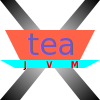

= Logo Art - My Logo Palace
:toc: macro
:toclevels: 3
Sun Qian <fredsuvn@163.com>
:emaill: fredsuvn@163.com
:url: https://github.com/fredsuvn/logo-art
:me-url: https://github.com/fredsuvn
:qq: QQ: 2510701977
:license: https://www.apache.org/licenses/LICENSE-2.0.html[Apache 2.0 license]

*Hi there, welcome to my logo palace!*

*This is an amazing place collects a lot of genius logos designed by a genius logo designer -- ME!*

toc::[]

== My Logos and Their History

=== Suvn

=== SrcLab

==== Boat

* `boat`:

* `boat-spring-boot`:

image:src/srclab/boat/5-boat/boat-spring-boot.svg[,64]

* `grpc-spring-boot`:

image:src/srclab/boat/5-boat/grpc-spring-boot.svg[,64]

==== Home

* `home-light`:

* `home-port`:

* `home-ship`:

=== Xhome

==== Xtea

* `xtea`:

* `xtea-spring-boot`:

* `grpc-spring-boot`:

=== Some Others

* `sonluo`:
image:src/sonluo/1-hive/sonluo.svg[,64]

* `tousie`:

* `ufotv`:
image:src/ufotv/1-hive/ufotv.svg[,64]

=== More in link:src[Here]!

== About Me

* {emaill}
* {me-url}
* {qq}
* {url}

== License

{license}